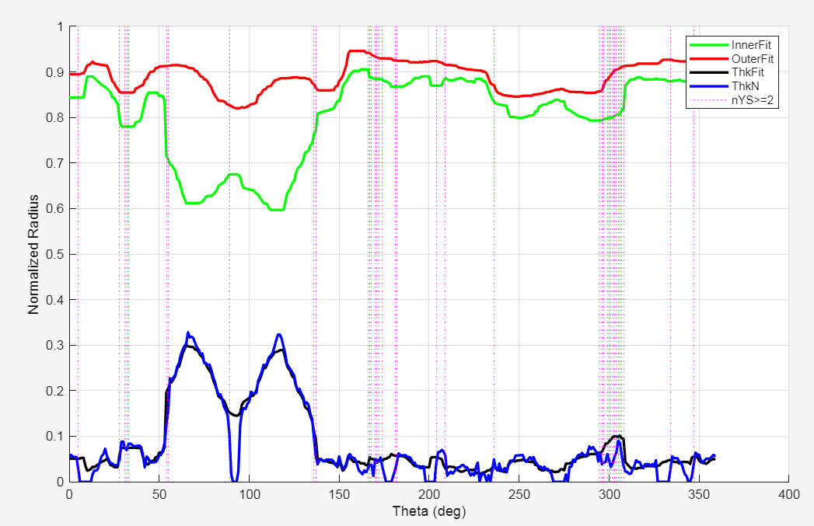

# MSQS-RQA Development Plan
## Example Output

## Project Title

MSQS-guided Anatomy-aware Radial Quality Analysis (RQA) for CT Skeletal Muscle Segmentation

---

# Current Objective

Develop an explainable quality assurance framework capable of:

1. Detecting segmentation leakage and missing regions
2. Localizing suspicious anatomical regions
3. Generating candidate bounding boxes (BBox)
4. Supporting semi-automated correction
5. Operating without ground truth during inference

Ground truth validation will be performed only after the framework stabilizes.

---

# Development Phase

## Phase 1. Baseline Quality Assessment

### Aim

Assess overall segmentation quality.

### Current Status

Completed

### Outputs

* MSQS
* Leak score
* Missing score
* Shape score
* HU score
* Smoothness score

### Decision

* Accept
* Revise
* Manual

---

## Phase 2. Radial Quality Analysis (RQA)

### Aim

Represent segmentation geometry using radial anatomical profiles.

### Current Status

Completed

### Features

* Body radius
* Inner radius
* Outer radius
* Thickness profile
* Segment count
* Segment density

### Outputs

* Radial outer score
* Thickness score
* Transition score
* Posterior multi-segment ratio
* Non-posterior multi-segment ratio

---

## Phase 3. Anatomical Sector Mapping

### Aim

Introduce anatomical awareness into radial analysis.

### Current Status

In Progress

### Tasks

Establish anatomical angular sectors using thetaRef.

Examples:

* Diaphragm zone
* Posterior/Psoas zone
* Lateral wall zone
* Anterior abdominal wall zone

### Expected Outcome

Reduce false-positive alerts caused by normal anatomy.

---

## Phase 4. Residual-Based Anomaly Detection

### Aim

Detect local segmentation abnormalities.

### Current Status

In Progress

### Features

* Outer residual
* Inner residual
* Density residual

Residual = Observed profile − Expected profile

### Statistical Analysis

* Robust Z-score
* Local outlier detection
* Cluster detection

### Expected Outcome

Identify candidate leakage and missing regions.

---

## Phase 5. Suspicious Region Localization

### Aim

Convert anomaly angles into image-space locations.

### Current Status

Planned

### Tasks

1. Convert anomaly theta to rays
2. Generate anomaly mask
3. Cluster neighboring rays
4. Generate bounding boxes

### Outputs

* Leakage BBox
* Missing BBox

---

## Phase 6. Semi-Automated Refinement

### Aim

Improve segmentation locally.

### Strategy

Minor leakage:

* Manual remove
* Active contour shrink

Minor missing:

* Active contour grow

Severe failure:

* Manual segmentation

### Notes

Active contour is used as a local refinement tool, not as the primary segmentation algorithm.

---

## Phase 7. Validation Phase

### Aim

Evaluate framework performance.

### Dataset

Ground truth dataset:

* Excellent cases
* Revise cases
* Failure cases

Approximately:

30–60 cases

### Evaluation Metrics

Segmentation:

* Dice
* IoU

Clinical body composition:

* SMA error
* SMD error

Quality assessment:

* MSQS agreement
* RQA agreement
* Human expert agreement

---

# Current Priority

DO NOT create large GT datasets yet.

Focus on:

1. Anatomical sector mapping
2. Residual analysis
3. Anomaly localization
4. Bounding box generation

Only after stable localization performance is achieved:

Proceed to GT generation and final validation.
